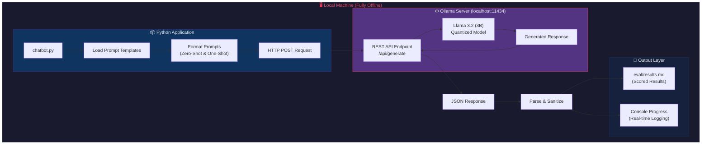
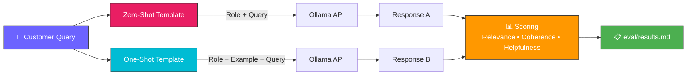
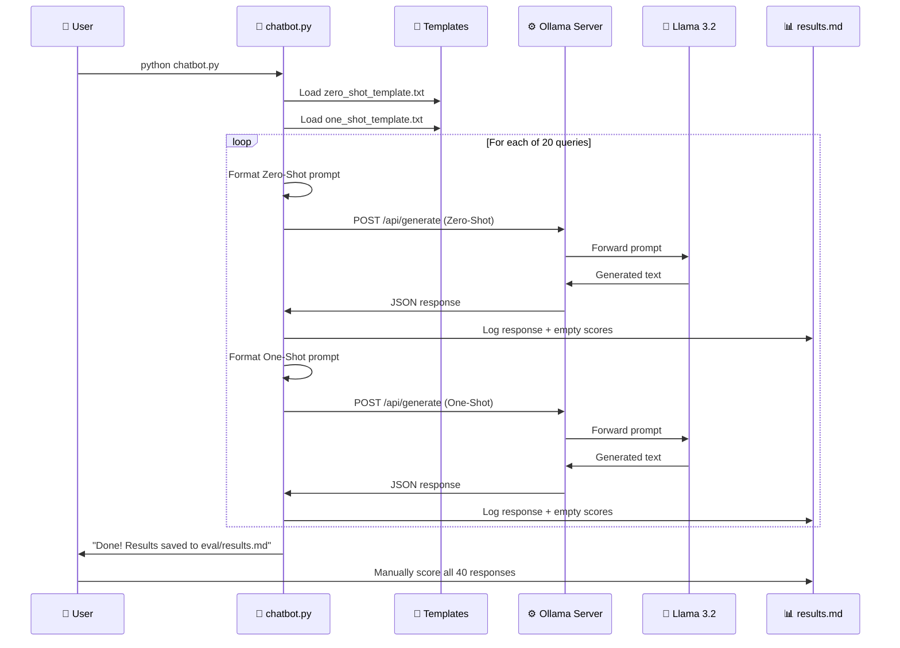
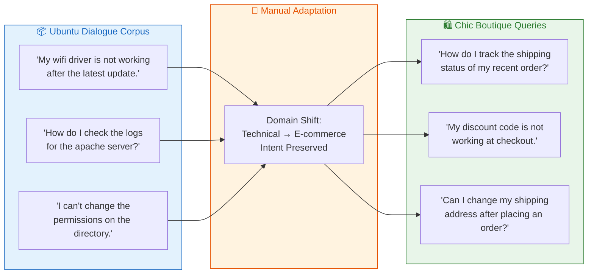
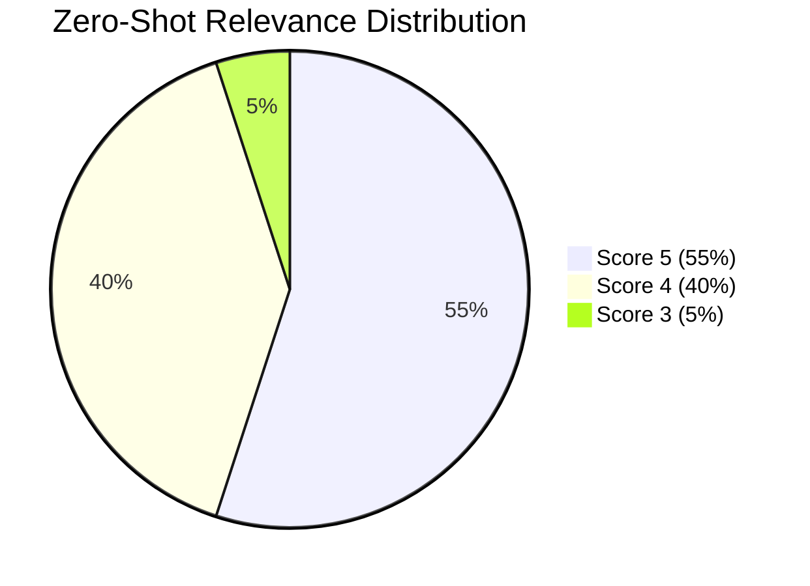
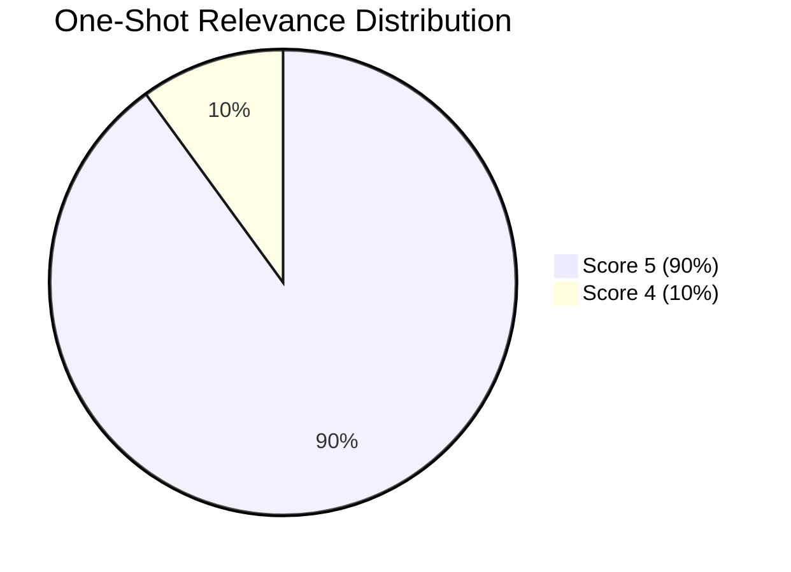

<p align="center">
  
  
  
  
  
</p>

<h1 align="center">🛍️ Chic Boutique — Offline Customer Support Chatbot</h1>

<p align="center">
  <strong>A privacy-first, fully offline AI chatbot for e-commerce customer support</strong><br>
  <em>Powered by Ollama × Meta Llama 3.2 (3B) — Zero data leaves your network</em>
</p>

<p align="center">
  <a href="#-quick-start">Quick Start</a> •
  <a href="#-architecture">Architecture</a> •
  <a href="#-key-findings">Key Findings</a> •
  <a href="#-documentation">Documentation</a>
</p>

---

## 📋 Project Overview

**Chic Boutique Offline Chatbot** is a fully functional, privacy-compliant customer support chatbot built for a fictional e-commerce store. It runs **entirely on local hardware** using [Ollama](https://ollama.com) to serve Meta's **Llama 3.2 (3B)** model — ensuring **zero customer data** ever leaves the company's network.

This project evaluates two fundamental prompt engineering strategies — **Zero-Shot** and **One-Shot** prompting — across 20 real-world e-commerce queries adapted from the **Ubuntu Dialogue Corpus**.

### 🎯 Core Objectives

| Objective | Description |
|---|---|
| 🔒 **Data Privacy** | Run LLMs locally to comply with GDPR, CCPA, and DPDP Act |
| 🧪 **Prompt Engineering** | Compare Zero-Shot vs. One-Shot prompting effectiveness |
| 📊 **Performance Evaluation** | Score model outputs on Relevance, Coherence, and Helpfulness |
| 🏭 **Feasibility Study** | Assess if a 3B-parameter model is viable for customer support |

---

## 🛠️ Tech Stack

| Layer | Technology | Purpose |
|---|---|---|
| **LLM Engine** | Meta Llama 3.2 (3B) | Instruction-tuned language model for text generation |
| **Model Server** | Ollama | Local REST API server for LLM inference |
| **Application** | Python 3.8+ | Script orchestration, API calls, result logging |
| **HTTP Client** | `requests` | Communication with Ollama's REST endpoint |
| **Data Source** | Ubuntu Dialogue Corpus | Source of customer queries (via HuggingFace `datasets`) |
| **Output** | Markdown | Structured evaluation results and reporting |

---

## 🏗️ Architecture

### High-Level System Architecture



### Prompt Processing Pipeline



---

## 📁 Code Structure

```
offline-customer-support-chatbot/
│
├── 📄 chatbot.py                         # Main script — queries Ollama API
│       ├── query_ollama()                # Sends prompts, handles errors
│       ├── load_template()               # Reads prompt templates from disk
│       ├── sanitize_for_markdown_table() # Cleans responses for MD tables
│       └── main()                        # Orchestrates the full pipeline
│
├── 📂 prompts/                           # Prompt engineering templates
│   ├── zero_shot_template.txt            # Instruction-only template
│   └── one_shot_template.txt             # Instruction + one example
│
├── 📂 eval/                              # Evaluation outputs
│   └── results.md                        # Scored results (40 rows)
│
├── 📄 report.md                          # Detailed analysis & findings
├── 📄 architecture.md                    # System architecture documentation
├── 📄 projectdocumentation.md            # Complete project documentation
├── 📄 setup.md                           # Environment setup guide
├── 📄 requirements.txt                   # Python dependencies
├── 📄 .gitignore                         # Git ignore rules
└── 📄 README.md                          # This file
```

---

## 🔄 Workflow

### End-to-End Execution Flow



### Data Adaptation Pipeline



---

## 📊 Key Findings

### Quantitative Results

| Metric | Zero-Shot Avg | One-Shot Avg | Δ Improvement |
|---|---|---|---|
| 🎯 **Relevance** | 4.50 | 4.90 | **+8.9%** ⬆️ |
| 📝 **Coherence** | 5.00 | 5.00 | 0.0% ➡️ |
| 💡 **Helpfulness** | 4.20 | 4.85 | **+15.5%** ⬆️ |
| ⭐ **Overall** | 4.57 | 4.92 | **+7.7%** ⬆️ |

### Score Distribution





### Key Insight

> **One-Shot prompting** delivers a **+15.5% improvement in Helpfulness** — the most business-critical metric for customer support. The single example acts as a powerful "style guide" that improves tone, format, and actionability.

### Example Comparison

| | Zero-Shot | One-Shot |
|---|---|---|
| **Query** | *"My discount code is not working at checkout."* | *Same query* |
| **Response** | "Please ensure that the code is entered correctly and has not expired. Also, check if the items in your cart are eligible for the discount." | "I'm sorry to hear that! Please double-check the spelling and expiration date. Some codes only apply to specific items. If it still fails, feel free to reach out!" |
| **Score** | R:4 C:5 H:4 | R:5 C:5 H:5 |
| **Analysis** | ❌ Reads like a FAQ entry | ✅ Empathetic, actionable, invites follow-up |

---

## 🚀 Quick Start

### Prerequisites

- **Python 3.8+** — [python.org](https://www.python.org/downloads/)
- **Ollama** — [ollama.com](https://ollama.com)
- **~2 GB** free disk space for model weights

### Installation

```bash
# 1. Install Ollama and pull the model
ollama pull llama3.2:3b

# 2. Clone this repository
git clone https://github.com/ramalokeshreddyp/ChicBot.git
cd ChicBot

# 3. Create virtual environment
python -m venv venv

# Windows:
venv\Scripts\activate
# macOS/Linux:
source venv/bin/activate

# 4. Install dependencies
pip install -r requirements.txt
```

### Running the Chatbot

```bash
# Ensure Ollama is running
ollama serve

# Execute the chatbot
python chatbot.py
```

### Running Tests

```bash
pytest -q
```

### Expected Output

```
============================================================
  Chic Boutique — Offline Customer Support Chatbot
  Model : llama3.2:3b
  Server: http://localhost:11434/api/generate
  Queries: 20
============================================================

[1/20] "How do I track the shipping status of my recent order?"
  Zero-Shot (3.2s): You can track your order by logging into your account...
  One-Shot  (2.8s): Hi there! You can easily track your order by visiting...

[2/20] "My discount code is not working at checkout."
  ...

============================================================
  Done! 20 queries × 2 methods = 40 responses
  Total time: 124.5s
  Results saved to: eval/results.md
============================================================
```

---

## 🌐 GitHub Pages Deployment

This repository now includes an automated GitHub Pages deployment pipeline.

### What was added

- **Workflow**: `.github/workflows/deploy-pages.yml`
- **Published site entry**: `docs/index.html`

### How deployment works

1. Push to `main` (or manually trigger the workflow from Actions).
2. GitHub Actions publishes the `docs/` folder to the `gh-pages` branch.
3. GitHub Pages serves content from the `gh-pages` branch root.

### One-time repository setup

1. Open your repository on GitHub.
2. Go to **Settings → Pages**.
3. Under **Build and deployment**, set **Source** to **Deploy from a branch**.
4. Choose **Branch: `gh-pages`** and **Folder: `/ (root)`**.
4. Push your latest commit containing the workflow.

### Site URL format

- `https://<your-username>.github.io/<your-repo-name>/`

The landing page links to key project artifacts: `README.md`, `architecture.md`, `projectdocumentation.md`, and `report.md`.

---

## 📚 Documentation

| Document | Description |
|---|---|
| 📖 [**report.md**](report.md) | Detailed analysis comparing Zero-Shot vs. One-Shot prompting |
| 🏗️ [**architecture.md**](architecture.md) | System architecture, design decisions, and component details |
| 📋 [**projectdocumentation.md**](projectdocumentation.md) | Complete project documentation covering all aspects |
| ⚙️ [**setup.md**](setup.md) | Step-by-step environment setup with troubleshooting |
| 📊 [**eval/results.md**](eval/results.md) | Full evaluation results with scores for all 40 responses |

---

## ⚠️ Limitations & Future Work

| Limitation | Proposed Solution |
|---|---|
| No real-time data access | Implement **RAG** with vector database (ChromaDB/FAISS) |
| Potential hallucinations | Add **output guardrails** and fact-checking layers |
| Single-turn only | Implement **conversation history** management |
| CPU-bound inference (~5s) | Deploy on **GPU hardware** for sub-second latency |
| No knowledge base | **Fine-tune** model on actual company policies |

---

<p align="center">
  <strong>Built with ❤️ for privacy-first AI</strong><br>
  <em>Llama 3.2 × Ollama × Python</em>
</p>
