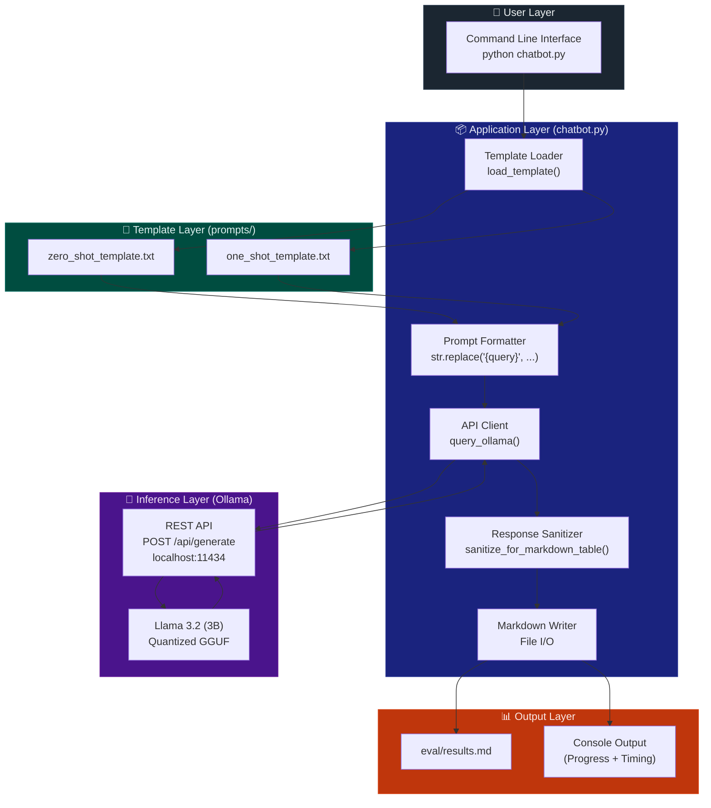
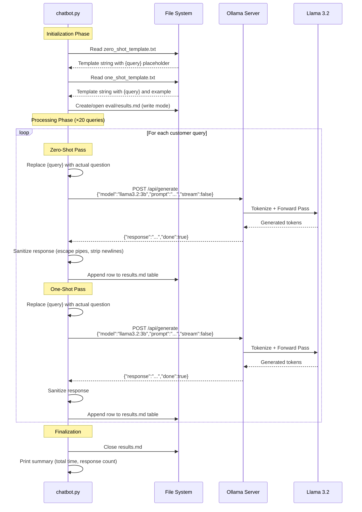
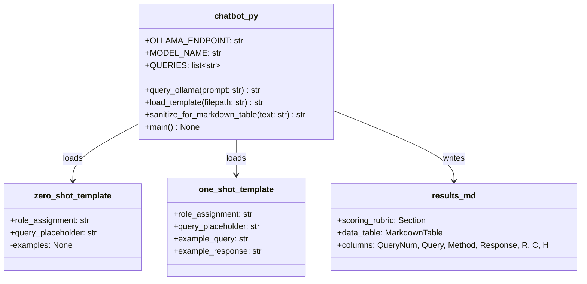
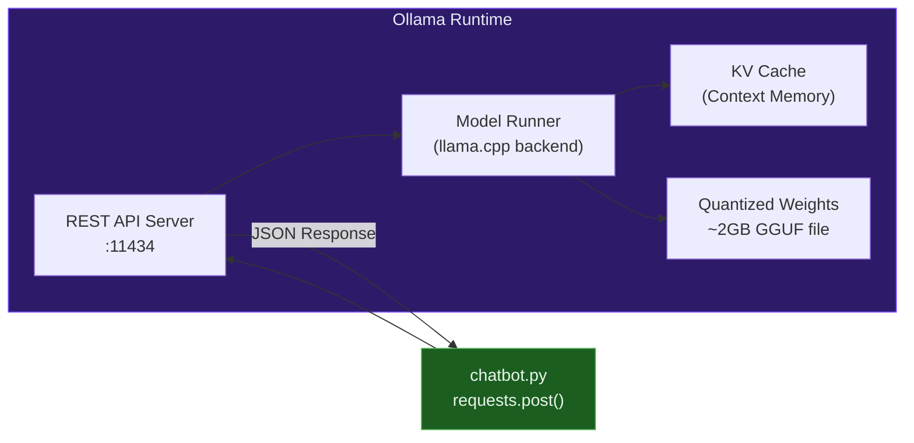
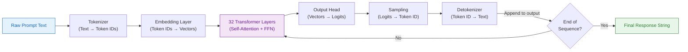
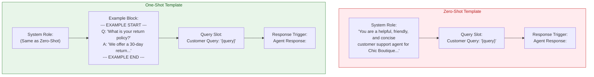
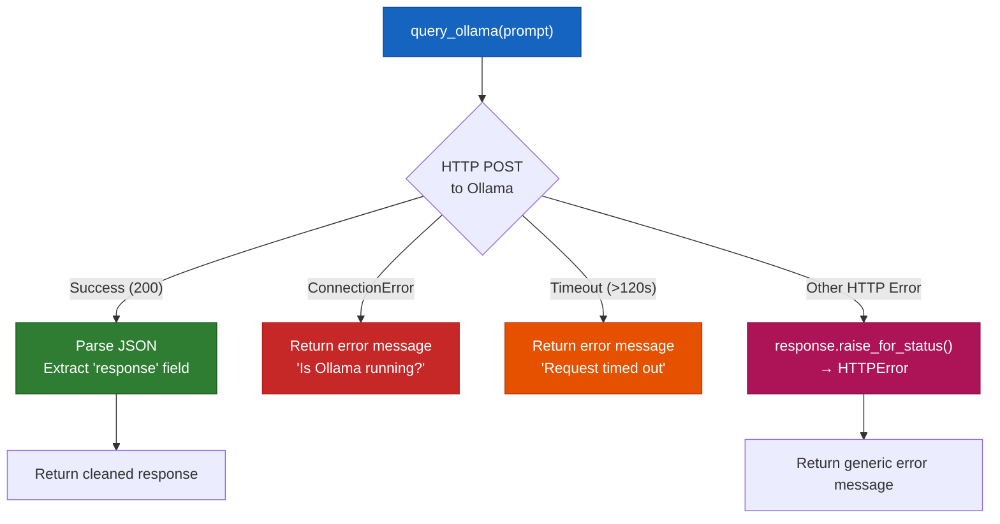
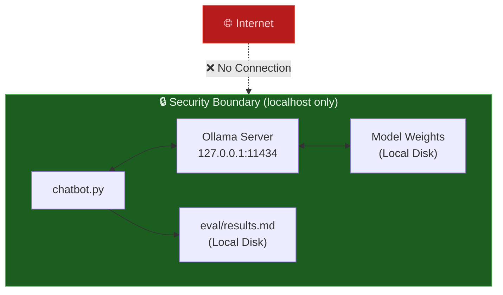

# 🏗️ Architecture Documentation

## Offline Customer Support Chatbot — Chic Boutique

---

## 1. System Overview

The Chic Boutique Offline Chatbot is a **single-machine, fully offline** application that leverages a locally-hosted Large Language Model (LLM) to generate customer support responses. The system is designed with **data privacy** as the primary architectural constraint — no network calls are made to external services at any point during operation.

### Design Philosophy

| Principle | Implementation |
|---|---|
| **Privacy by Design** | All inference runs on `localhost`; no external API calls |
| **Simplicity** | Single Python script, no database, no web framework |
| **Reproducibility** | Deterministic pipeline: same queries → same prompt → logged results |
| **Separation of Concerns** | Templates, logic, and output are in separate files/directories |

---

## 2. Architecture Diagram

### 2.1 High-Level Component Architecture



### 2.2 Request-Response Data Flow



---

## 3. Component Architecture

### 3.1 Module Breakdown



### 3.2 Function Responsibilities

| Function | Input | Output | Responsibility |
|---|---|---|---|
| `query_ollama(prompt)` | Formatted prompt string | Model response text | HTTP POST to Ollama API, error handling, JSON parsing |
| `load_template(filepath)` | File path string | Raw template string | Reads UTF-8 text file from disk |
| `sanitize_for_markdown_table(text)` | Raw response text | Cleaned single-line text | Escapes `\|`, removes `\n`, collapses whitespace |
| `main()` | — | — | Orchestrates the full pipeline: load → format → query → log |

---

## 4. Inference Architecture

### 4.1 Ollama Server Architecture



### 4.2 Model Specifications

| Property | Value |
|---|---|
| **Model** | Meta Llama 3.2 |
| **Parameters** | 3 Billion |
| **Quantization** | Q4_0 (4-bit) via Ollama |
| **Model File Size** | ~2 GB |
| **Context Window** | 128K tokens |
| **Architecture** | Transformer (decoder-only) |
| **Training** | Instruction-tuned (chat-optimized) |

### 4.3 Inference Pipeline



---

## 5. Prompt Architecture

### 5.1 Template Design



### 5.2 Prompt Structure Comparison

| Component | Zero-Shot | One-Shot |
|---|---|---|
| Role Assignment | ✅ Present | ✅ Present |
| Guard Rail ("Don't make up info") | ✅ Present | ✅ Present |
| Example Q&A Pair | ❌ Absent | ✅ 1 pair (return policy) |
| Query Placeholder | ✅ `{query}` | ✅ `{query}` |
| Token Count (approx.) | ~50 tokens | ~90 tokens |
| Expected Behavior | General instruction following | Style-guided generation |

---

## 6. Error Handling Architecture



---

## 7. Output Architecture

### 7.1 Results File Structure

The `eval/results.md` file follows a strict markdown table schema:

```
# Evaluation Results

## Scoring Rubric
[Criterion definitions]

| Query # | Customer Query | Prompting Method | Response | Relevance | Coherence | Helpfulness |
|---------|---------------|-----------------|----------|-----------|-----------|-------------|
| 1       | "..."         | Zero-Shot       | "..."    | 5         | 5         | 5           |
| 1       | "..."         | One-Shot        | "..."    | 5         | 5         | 5           |
| ...     | ...           | ...             | ...      | ...       | ...       | ...         |
```

**Schema guarantees:**
- Exactly **40 rows** (20 queries × 2 methods)
- Every query appears exactly **twice** (once per method)
- Scores are integers in range **[1, 5]**
- Responses are single-line (sanitized)

---

## 8. Security & Privacy Architecture



| Security Feature | Implementation |
|---|---|
| **No external API calls** | Ollama runs on `localhost:11434` only |
| **No data exfiltration** | All outputs written to local filesystem |
| **No credentials stored** | No API keys, tokens, or secrets required |
| **No PII processing** | Queries are fictional; no real customer data |
| **GDPR/CCPA compliant** | Data never leaves the local machine |

---

## 9. Technology Decisions

### Why Ollama?

| Alternative | Limitation | Ollama Advantage |
|---|---|---|
| OpenAI API | Requires internet, costs money, data leaves network | Free, offline, private |
| Hugging Face Transformers | Complex setup, requires PyTorch/CUDA | Single binary, auto-quantization |
| llama.cpp (raw) | Manual compilation, no REST API out of box | Built-in REST API, model management |
| vLLM | Complex, designed for multi-GPU servers | Lightweight, runs on laptops |

### Why Llama 3.2 (3B)?

| Alternative | Trade-off |
|---|---|
| Llama 3.2 (1B) | Too small — quality degrades significantly |
| Llama 3.1 (8B) | Better quality but requires 8GB+ RAM |
| Mistral 7B | Strong alternative, but larger memory footprint |
| Llama 3.1 (70B) | Excellent quality but needs GPU server |

**The 3B model hits the sweet spot**: good enough quality for basic support, small enough to run on any modern laptop.

### Why Python + `requests`?

| Alternative | Reason Not Chosen |
|---|---|
| `ollama` Python package | Adds unnecessary dependency for simple REST calls |
| `aiohttp` (async) | Overkill — queries are sequential by design |
| `curl` / bash script | Less readable, harder to maintain |
| Node.js / `fetch` | Python is the ML ecosystem standard |

---

## 10. Scalability Considerations

While this prototype is a single-script tool, the architecture can scale:

| Scale | Approach |
|---|---|
| **Multi-model** | Add more templates and loop over multiple Ollama model names |
| **RAG Integration** | Add ChromaDB/FAISS vector store for knowledge grounding |
| **Web Interface** | Wrap `query_ollama()` in a Flask/FastAPI endpoint |
| **Batch Processing** | Current design already supports batch — just add more queries |
| **GPU Acceleration** | Ollama automatically uses GPU if available (NVIDIA CUDA, Apple Metal) |
| **Multi-turn Chat** | Switch from `/api/generate` to `/api/chat` endpoint |
