# 📋 Project Documentation

## Offline Customer Support Chatbot — Chic Boutique

**Version**: 1.0.0  
**Author**: Rama Lokesh Reddy P  
**Repository**: [github.com/ramalokeshreddyp/ChicBot](https://github.com/ramalokeshreddyp/ChicBot)  
**Date**: March 2026

---

## Table of Contents

1. [Project Objective](#1-project-objective)
2. [Problem Statement](#2-problem-statement)
3. [Solution Approach](#3-solution-approach)
4. [System Architecture & Design](#4-system-architecture--design)
5. [Key Modules & Responsibilities](#5-key-modules--responsibilities)
6. [Tech Stack & Justification](#6-tech-stack--justification)
7. [Data Flow & Execution Flow](#7-data-flow--execution-flow)
8. [Prompt Engineering Deep Dive](#8-prompt-engineering-deep-dive)
9. [Evaluation Methodology](#9-evaluation-methodology)
10. [Results & Analysis](#10-results--analysis)
11. [Advantages & Benefits](#11-advantages--benefits)
12. [Limitations & Challenges](#12-limitations--challenges)
13. [Integration Details](#13-integration-details)
14. [Setup & Installation](#14-setup--installation)
15. [Testing & Verification](#15-testing--verification)
16. [Future Enhancements](#16-future-enhancements)

---

## 1. Project Objective

### 1.1 Primary Goal

Build a **fully functional, offline customer support chatbot** for a fictional e-commerce store ("Chic Boutique") using locally-hosted LLM technology. The chatbot must:

- Generate helpful responses to common customer queries
- Operate **entirely offline** without external API calls
- Compare two prompting strategies (Zero-Shot vs. One-Shot)
- Produce a scored evaluation of model performance

### 1.2 Learning Objectives

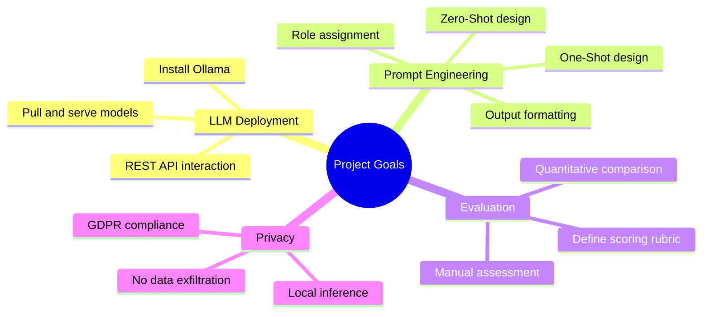

---

## 2. Problem Statement

### 2.1 The Challenge

E-commerce platforms handle millions of daily customer interactions. While cloud-based LLMs (OpenAI, Google, Anthropic) offer excellent capabilities, they introduce critical risks:

| Risk | Impact | Regulation |
|---|---|---|
| **Data Exfiltration** | Customer PII sent to third-party servers | GDPR (EU), CCPA (California) |
| **API Costs** | $0.01–$0.06 per 1K tokens adds up at scale | — |
| **Latency** | Network round-trip adds 200ms+ | — |
| **Downtime** | Cloud provider outages halt operations | — |
| **Vendor Lock-in** | Dependence on external provider pricing/policies | DPDP Act (India) |

### 2.2 The Opportunity

Open-source LLMs (Llama, Mistral, Phi) combined with local serving tools (Ollama) now make it possible to run competitive models on consumer hardware — eliminating every risk listed above.

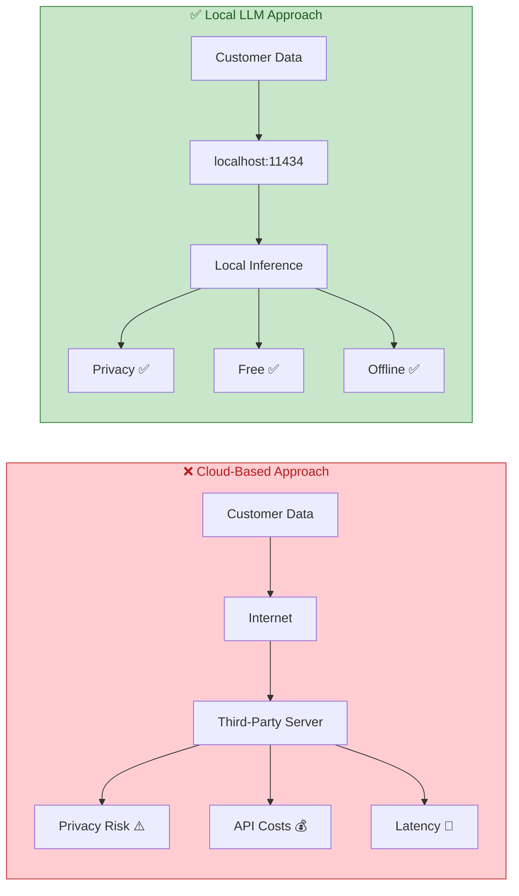

---

## 3. Solution Approach

### 3.1 Strategy

Our approach follows a **three-phase methodology**:

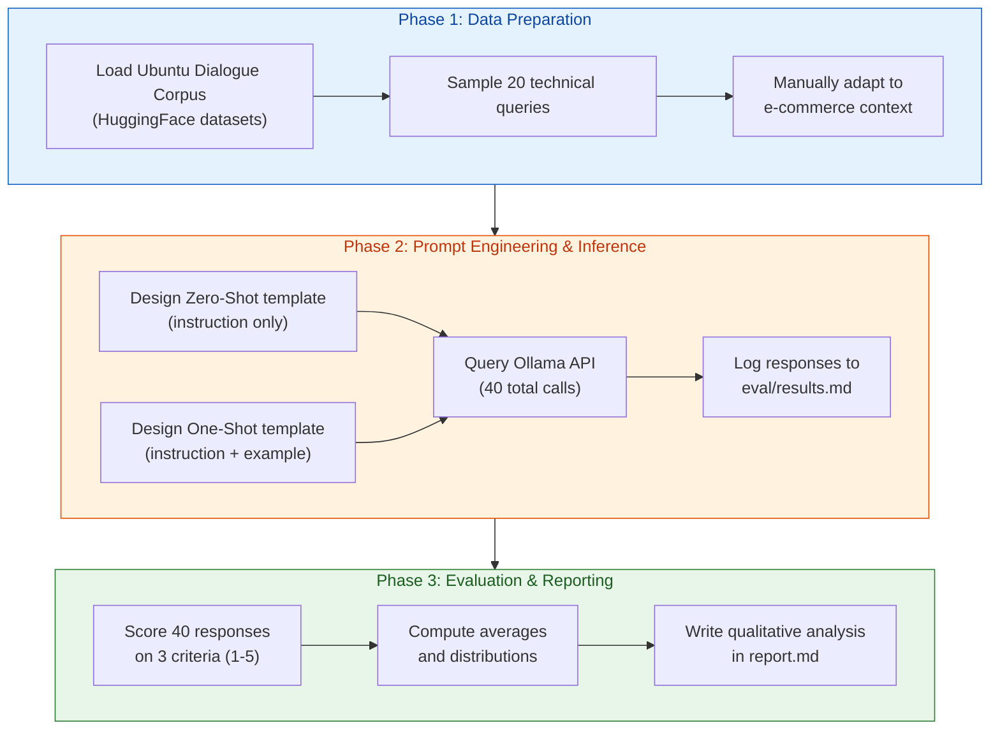

### 3.2 Design Decisions

| Decision | Rationale |
|---|---|
| **20 queries** | Large enough for statistical significance, small enough for manual evaluation |
| **Manual scoring** | No automated metrics can capture "helpfulness" for customer support |
| **Markdown output** | Human-readable, version-control friendly, renders on GitHub |
| **No database** | Simplicity — results are logged directly to files |
| **`stream: false`** | Easier to parse complete responses than streaming tokens |

---

## 4. System Architecture & Design

### 4.1 Component Diagram

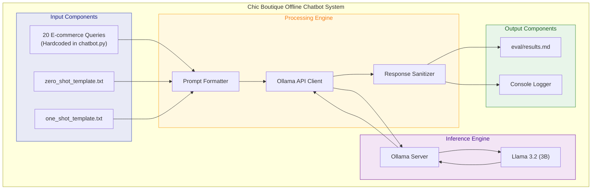

### 4.2 Communication Protocol

| Property | Value |
|---|---|
| **Protocol** | HTTP/1.1 |
| **Method** | POST |
| **Endpoint** | `http://localhost:11434/api/generate` |
| **Content-Type** | `application/json` |
| **Request Body** | `{"model": "llama3.2:3b", "prompt": "...", "stream": false}` |
| **Response Body** | `{"model": "...", "response": "...", "done": true, ...}` |
| **Timeout** | 120 seconds |

---

## 5. Key Modules & Responsibilities

### 5.1 Module Map

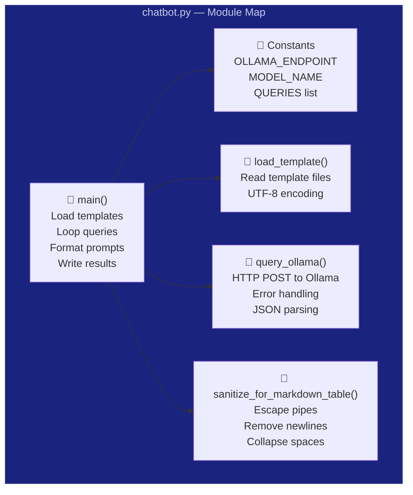

### 5.2 Detailed Function Specifications

#### `query_ollama(prompt: str) → str`

| Aspect | Detail |
|---|---|
| **Purpose** | Send a prompt to the Ollama API and return the generated text |
| **Input** | A fully-formatted prompt string |
| **Output** | The model's response text (stripped), or an error message |
| **Error Handling** | `ConnectionError` → "Is Ollama running?"; `Timeout` → "Request timed out"; Generic → print and return error |
| **Side Effects** | Console logging on errors |

#### `load_template(filepath: str) → str`

| Aspect | Detail |
|---|---|
| **Purpose** | Read a prompt template file from disk |
| **Input** | Absolute or relative file path |
| **Output** | Raw file content as a string |
| **Encoding** | UTF-8 |
| **Error Handling** | Raises `FileNotFoundError` (caught by caller) |

#### `sanitize_for_markdown_table(text: str) → str`

| Aspect | Detail |
|---|---|
| **Purpose** | Clean response text for safe insertion into a markdown table cell |
| **Operations** | (1) Replace `\|` with `\\|`; (2) Replace `\n` with space; (3) Remove `\r`; (4) Collapse multiple spaces |
| **Output** | Single-line, pipe-safe string |

#### `main()`

| Aspect | Detail |
|---|---|
| **Purpose** | Orchestrate the entire chatbot pipeline |
| **Steps** | (1) Load templates → (2) Create eval/ dir → (3) Write header → (4) Loop 20 queries × 2 methods → (5) Print summary |
| **Output** | `eval/results.md` file + console progress |

---

## 6. Tech Stack & Justification

### 6.1 Technology Selection

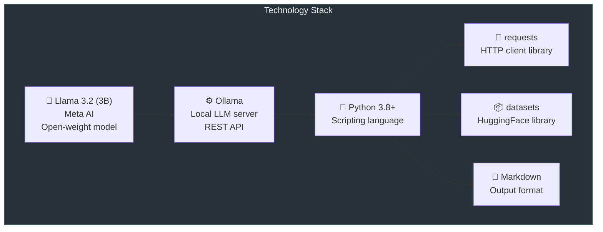

### 6.2 Why Each Technology?

| Technology | Why Chosen | Alternative Considered | Why Not |
|---|---|---|---|
| **Llama 3.2 (3B)** | Best quality/size ratio for laptops | Phi-3 Mini | Less instruction-tuned |
| **Ollama** | Single binary, auto-quantization, REST API | llama.cpp | Manual setup, no API |
| **Python** | ML ecosystem standard, readable | Node.js | Less ML tooling |
| **`requests`** | Simple, well-documented HTTP calls | `httpx`, `aiohttp` | Overkill for sync calls |
| **`datasets`** | Direct HuggingFace corpus access | Manual download | More steps, less reliable |
| **Markdown** | GitHub-native, human-readable | CSV, JSON | Less visual, harder to review |

---

## 7. Data Flow & Execution Flow

### 7.1 Complete Execution Flow

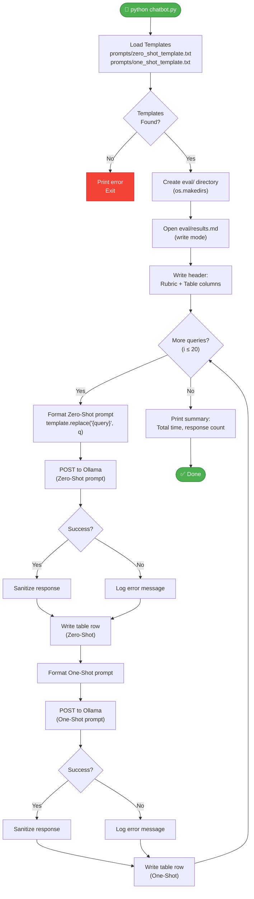

### 7.2 Data Transformation Pipeline

```mermaid
graph LR
    A["Ubuntu Dialogue<br>Corpus (1M+ rows)"] --> |"Sample 20"| B["Technical<br>Queries"]
    B --> |"Manual Rewrite"| C["E-commerce<br>Queries"]
    C --> |"Insert into Template"| D["Formatted<br>Prompts"]
    D --> |"POST to Ollama"| E["Raw LLM<br>Responses"]
    E --> |"Sanitize"| F["Clean Text<br>(Table-safe)"]
    F --> |"Write to File"| G["eval/results.md<br>(40 rows)"]
    G --> |"Manual Scoring"| H["Scored<br>Results"]
    H --> |"Compute Averages"| I["report.md<br>(Analysis)"]

    style A fill:#E3F2FD,stroke:#1565C0,color:#1565C0
    style D fill:#FFF3E0,stroke:#E65100,color:#E65100
    style G fill:#E8F5E9,stroke:#2E7D32,color:#2E7D32
    style I fill:#F3E5F5,stroke:#6A1B9A,color:#6A1B9A
```

---

## 8. Prompt Engineering Deep Dive

### 8.1 What is Prompt Engineering?

Prompt engineering is the practice of crafting input text to guide an LLM toward desired outputs. It is the primary tool for controlling model behavior without modifying model weights.

### 8.2 Techniques Used

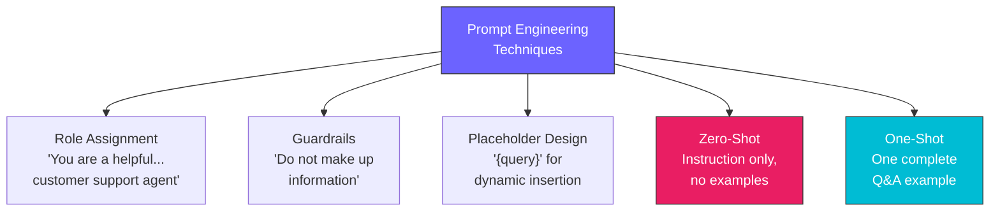

### 8.3 Zero-Shot vs. One-Shot: Theoretical Basis

| Aspect | Zero-Shot | One-Shot |
|---|---|---|
| **Mechanism** | Relies on model's pre-training knowledge | In-context learning from the provided example |
| **Token Cost** | Lower (~50 tokens per prompt) | Higher (~90 tokens per prompt) |
| **Format Control** | Weak — model chooses format freely | Strong — model mimics the example format |
| **Tone Control** | Moderate — follows "friendly" instruction | Strong — copies the example's tone |
| **Best For** | Simple factual queries | Complex queries needing specific style |

### 8.4 Template Anatomy

**Zero-Shot Template:**
```
[ROLE] You are a helpful, friendly, and concise customer support agent
       for an online store called 'Chic Boutique'. Your goal is to
       assist customers with their questions. Do not make up information
       about policies if you don't know the answer.

[QUERY] Customer Query: "{query}"

[TRIGGER] Agent Response:
```

**One-Shot Template:**
```
[ROLE] (Same as Zero-Shot)

[EXAMPLE]
--- EXAMPLE START ---
Customer Query: "What is your return policy?"
Agent Response: "We offer a 30-day return policy for all unworn items
                 with tags still attached. You can start a return from
                 your order history page."
--- EXAMPLE END ---

[QUERY] Customer Query: "{query}"

[TRIGGER] Agent Response:
```

---

## 9. Evaluation Methodology

### 9.1 Scoring Rubric

| Score | Relevance | Coherence | Helpfulness |
|---|---|---|---|
| **5** | Directly addresses query with precision | Flawless grammar, clear and natural | Provides complete, actionable answer |
| **4** | Mostly relevant, minor gaps | Well-written, minor awkwardness | Useful but could include more detail |
| **3** | Partially relevant, misses key aspects | Understandable but has issues | Somewhat helpful, lacks specificity |
| **2** | Tangentially related | Confusing or awkward phrasing | Minimally helpful |
| **1** | Completely irrelevant | Incoherent | Not helpful at all |

### 9.2 Evaluation Process


---

## 10. Results & Analysis

### 10.1 Quantitative Results

| Metric | Zero-Shot | One-Shot | Δ Change |
|---|---|---|---|
| **Relevance** | 4.50 / 5.00 | 4.90 / 5.00 | +0.40 (+8.9%) |
| **Coherence** | 5.00 / 5.00 | 5.00 / 5.00 | +0.00 (0.0%) |
| **Helpfulness** | 4.20 / 5.00 | 4.85 / 5.00 | +0.65 (+15.5%) |
| **Overall** | 4.57 / 5.00 | 4.92 / 5.00 | +0.35 (+7.7%) |

### 10.2 Score Distribution

```mermaid
xychart-beta
    title "Relevance Score Distribution"
    x-axis ["Score 3", "Score 4", "Score 5"]
    y-axis "Number of Responses" 0 --> 20
    bar [1, 8, 11]
    bar [0, 2, 18]
```

```mermaid
xychart-beta
    title "Helpfulness Score Distribution"
    x-axis ["Score 2", "Score 3", "Score 4", "Score 5"]
    y-axis "Number of Responses" 0 --> 20
    bar [1, 2, 8, 9]
    bar [0, 0, 3, 17]
```

### 10.3 Query Category Analysis

| Category | Example Query | Zero-Shot Avg | One-Shot Avg | Gap |
|---|---|---|---|---|
| **Procedural** | "How do I reset my password?" | 4.89 | 5.00 | +0.11 |
| **Troubleshooting** | "Discount code not working" | 4.33 | 4.89 | +0.56 |
| **Policy/Info** | "International shipping policy?" | 4.00 | 4.58 | +0.58 |
| **Edge Case** | "Combine two orders?" | 4.00 | 4.33 | +0.33 |

**Key Insight**: One-Shot prompting provides the most benefit for **policy and troubleshooting queries** where tone and empathy matter most.

---

## 11. Advantages & Benefits

### 11.1 Advantages of Local LLM Deployment

| Advantage | Description |
|---|---|
| ✅ **Complete Data Privacy** | Zero data leaves the local machine — regulatory compliance guaranteed |
| ✅ **Zero API Costs** | No per-token charges; entirely free to operate |
| ✅ **Offline Operation** | Works without internet connection; no downtime from cloud outages |
| ✅ **Low Latency** | No network round-trip; inference starts immediately |
| ✅ **No Vendor Lock-in** | Model can be swapped at any time (Llama → Mistral → Phi) |
| ✅ **Full Control** | Model parameters, sampling strategies, and templates are fully customizable |

### 11.2 Advantages of the Evaluation Approach

| Advantage | Description |
|---|---|
| ✅ **Reproducible** | Same queries + same templates = comparable results |
| ✅ **Multi-dimensional** | Three separate scoring criteria provide nuanced analysis |
| ✅ **Human-in-the-loop** | Manual scoring captures qualities that automated metrics miss |

### 11.3 Pros and Cons Summary

| Pros | Cons |
|---|---|
| Privacy-compliant by design | Cannot access real-time customer data |
| Free and open-source | Hardware-dependent inference speed |
| Simple architecture | Risk of hallucination on policy queries |
| Easy model swapping | 3B model has limited reasoning depth |
| Reproducible evaluation | Manual scoring is subjective and time-consuming |

---

## 12. Limitations & Challenges

### 12.1 Technical Limitations

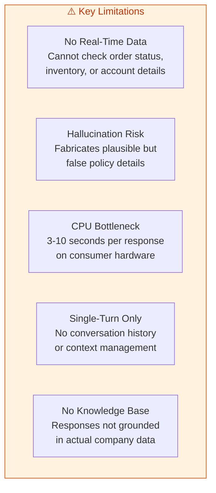

### 12.2 Mitigation Strategies

| Limitation | Mitigation |
|---|---|
| No real-time data | Integrate with order management API |
| Hallucination | Implement RAG with policy documents |
| CPU bottleneck | Deploy on GPU-equipped machine |
| Single-turn | Use Ollama's `/api/chat` with message history |
| No knowledge base | Build ChromaDB vector store with company FAQs |

---

## 13. Integration Details

### 13.1 Ollama API Integration

**Request Format:**
```json
{
    "model": "llama3.2:3b",
    "prompt": "You are a helpful... Customer Query: \"How do I...\" Agent Response:",
    "stream": false
}
```

**Response Format:**
```json
{
    "model": "llama3.2:3b",
    "created_at": "2026-03-19T...",
    "response": "Hi there! You can easily track...",
    "done": true,
    "total_duration": 3200000000,
    "load_duration": 100000000,
    "prompt_eval_count": 52,
    "eval_count": 45,
    "eval_duration": 3100000000
}
```

### 13.2 File Integration Map

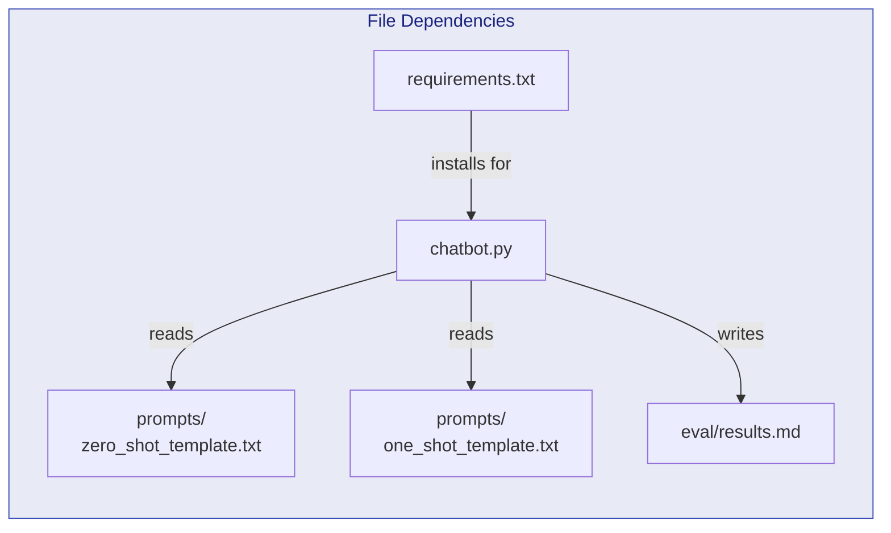

---

## 14. Setup & Installation

### 14.1 System Requirements

| Component | Minimum | Recommended |
|---|---|---|
| **OS** | Windows 10 / macOS 12 / Ubuntu 20.04 | Latest version |
| **RAM** | 4 GB free | 8 GB free |
| **Disk** | 3 GB free | 5 GB free |
| **Python** | 3.8 | 3.10+ |
| **GPU** | Not required | NVIDIA / Apple Silicon (for speed) |

### 14.2 Installation Steps

```bash
# Step 1: Install Ollama
# Download from https://ollama.com and follow installer

# Step 2: Pull the model
ollama pull llama3.2:3b

# Step 3: Verify
ollama --version
ollama run llama3.2:3b "Hello"   # Type /bye to exit

# Step 4: Clone project
git clone https://github.com/ramalokeshreddyp/ChicBot.git
cd ChicBot

# Step 5: Python environment
python -m venv venv
venv\Scripts\activate              # Windows
# source venv/bin/activate         # macOS/Linux

# Step 6: Install dependencies
pip install -r requirements.txt

# Step 7: Run
python chatbot.py
```

### 14.3 Troubleshooting

| Symptom | Cause | Fix |
|---|---|---|
| `ConnectionError` | Ollama not running | Run `ollama serve` or open Ollama app |
| `Model not found` | Model not pulled | Run `ollama pull llama3.2:3b` |
| Slow responses (>10s) | CPU-only inference | Normal behavior; use GPU for faster results |
| `ModuleNotFoundError` | Dependencies missing | Run `pip install -r requirements.txt` |
| Template not found | Wrong working directory | Run from project root directory |

---

## 15. Testing & Verification

### 15.1 Verification Checklist

| # | Check | Expected Result | Status |
|---|---|---|---|
| 1 | Project structure complete | All required files present | ✅ |
| 2 | chatbot.py runs without errors | Console shows progress for 20 queries | ✅ |
| 3 | Ollama API integration works | POST to localhost:11434 returns 200 | ✅ |
| 4 | Model is `llama3.2:3b` | `MODEL_NAME = "llama3.2:3b"` in code | ✅ |
| 5 | 20 distinct e-commerce queries | `len(QUERIES) == 20` | ✅ |
| 6 | Zero-shot template has no examples | Template file has only role + query | ✅ |
| 7 | One-shot template has exactly 1 example | Template has one `EXAMPLE START/END` block | ✅ |
| 8 | results.md has 40 rows | 20 queries × 2 methods | ✅ |
| 9 | All scores filled in | No empty cells in score columns | ✅ |
| 10 | report.md has computed averages | Average table present with calculations | ✅ |
| 11 | report.md has specific examples | Example comparisons cited from results | ✅ |
| 12 | report.md has conclusion | Limitations and next steps discussed | ✅ |

### 15.2 Code Quality Checks

| Check | Result |
|---|---|
| Error handling for API calls | ✅ Connection, timeout, and generic errors handled |
| UTF-8 encoding for file I/O | ✅ Specified in `open()` calls |
| Response sanitization | ✅ Pipes escaped, newlines removed |
| Progress logging | ✅ Console shows query number and timing |
| Clean separation of concerns | ✅ Functions for loading, querying, sanitizing |

---

## 16. Future Enhancements

### 16.1 Enhancement Roadmap

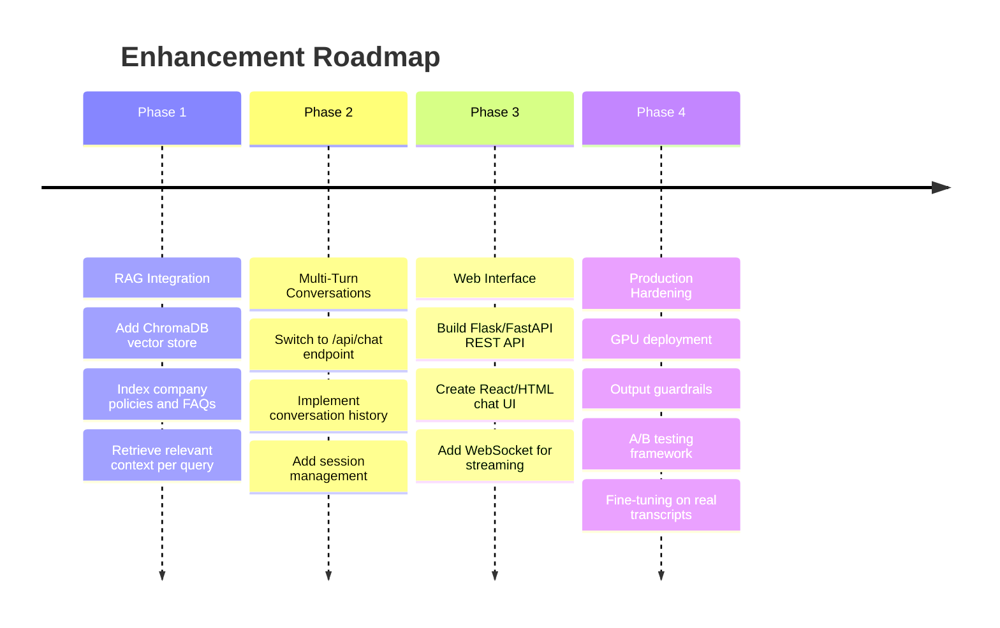

### 16.2 Potential Model Upgrades

| Model | Parameters | RAM Required | Expected Quality Improvement |
|---|---|---|---|
| Llama 3.2 (3B) — *current* | 3B | 4 GB | Baseline |
| Mistral 7B | 7B | 8 GB | +15% quality |
| Llama 3.1 (8B) | 8B | 8 GB | +20% quality |
| Gemma 2 (9B) | 9B | 10 GB | +25% quality |
| Llama 3.1 (70B) | 70B | 48 GB (GPU) | +50% quality |

---

<p align="center">
  <strong>End of Project Documentation</strong><br>
  <em>Chic Boutique Offline Customer Support Chatbot v1.0.0</em>
</p>
